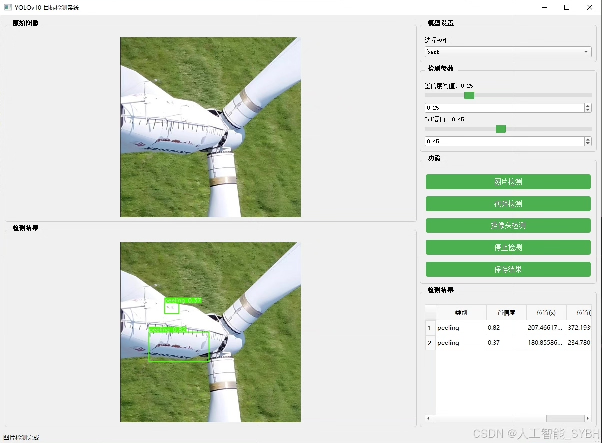
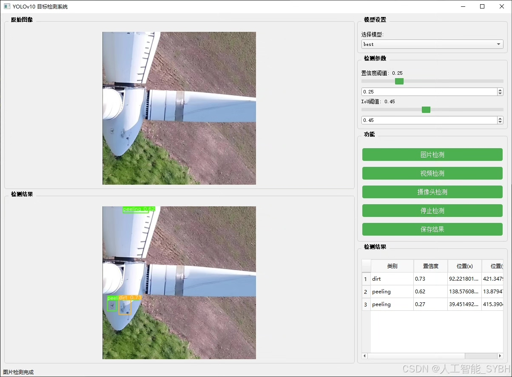
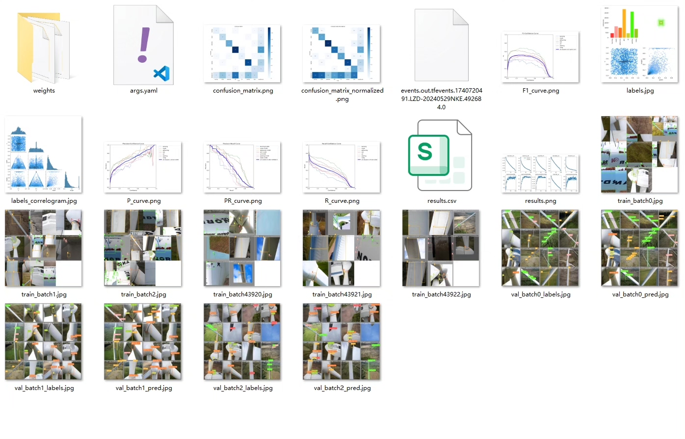
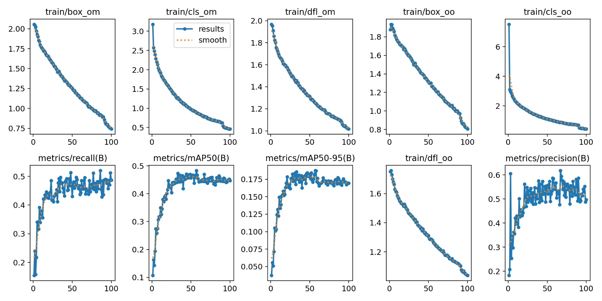
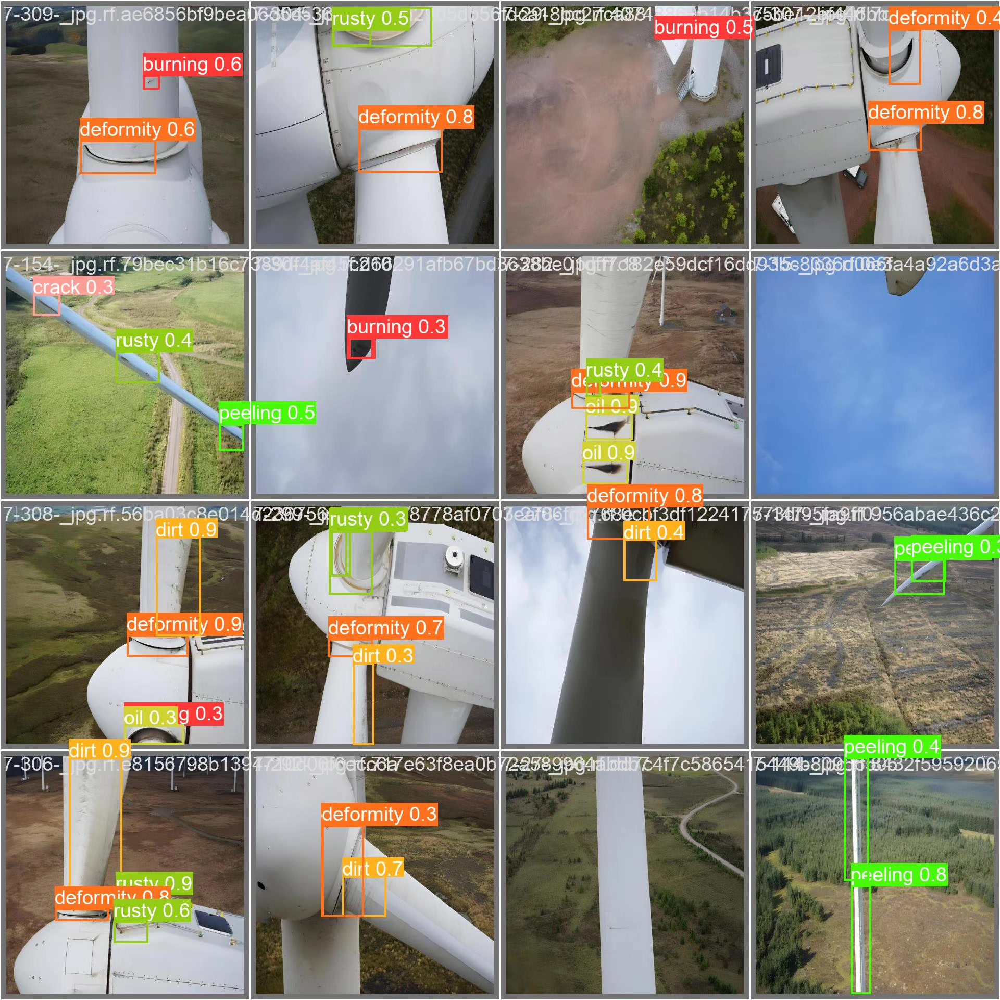
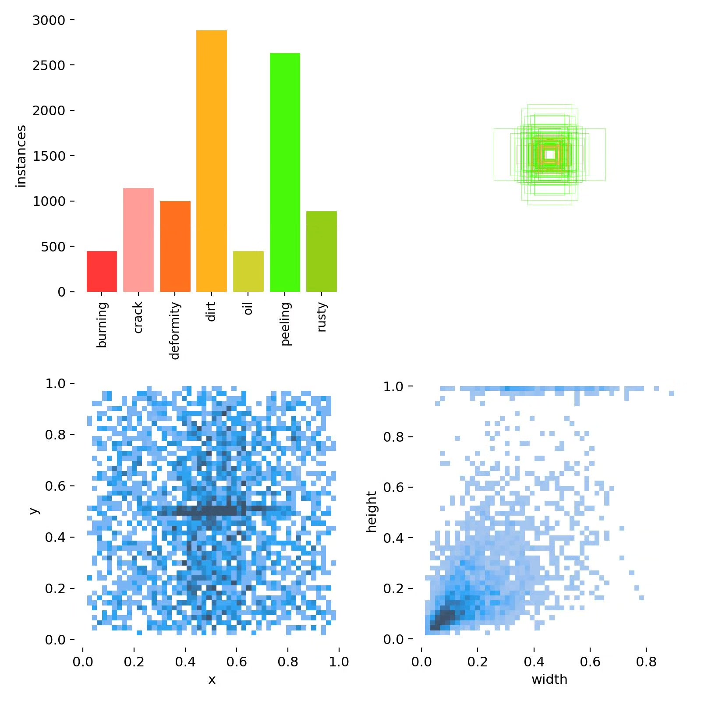
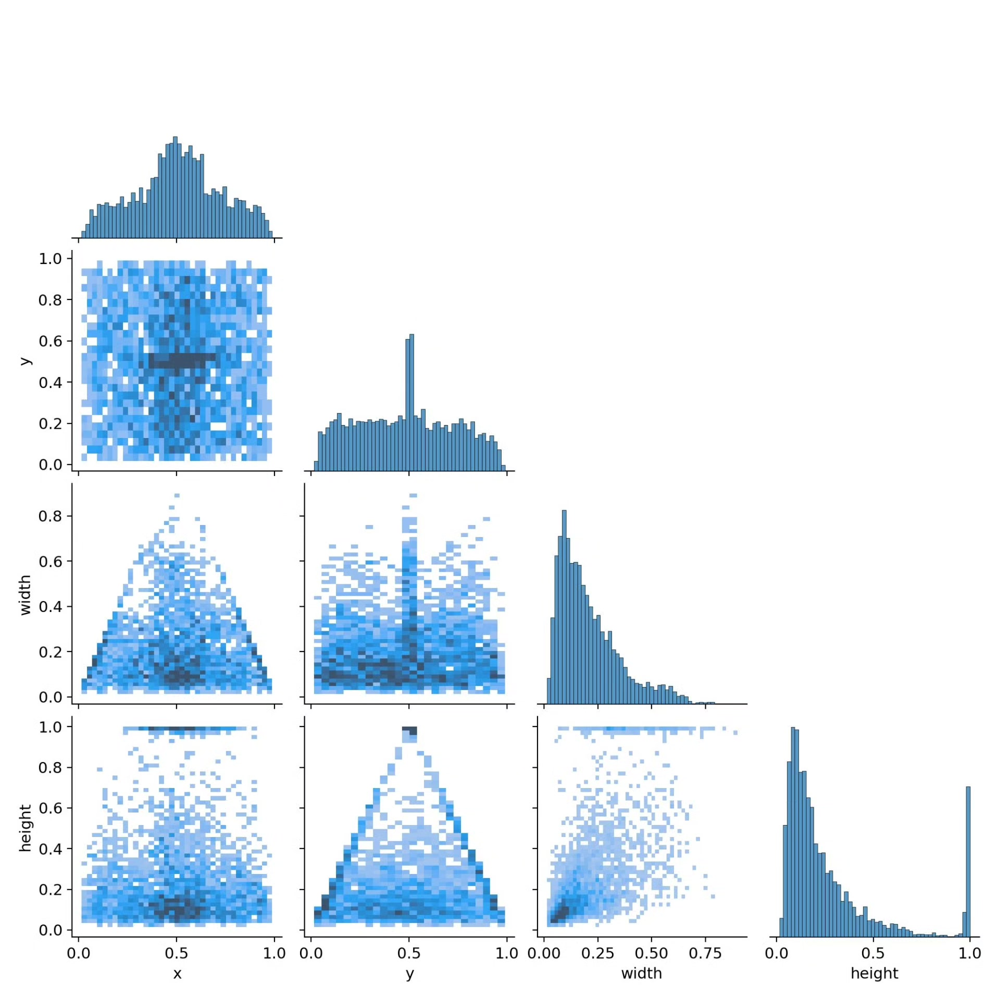
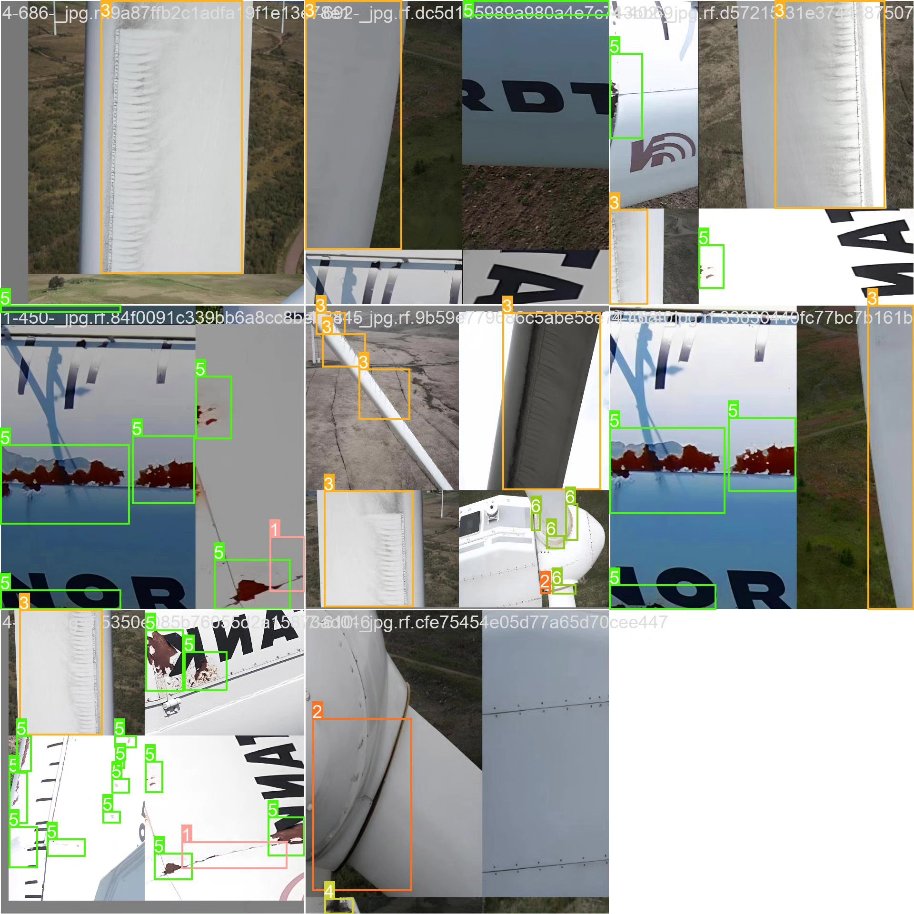

# Based on deep learning YOLOv10 for wind turbine blade defect detection system (YO

## Body

A wind turbine blade defect detection system based on deep learning YOLOv10 (YOLOv10+YOLO dataset + UI interface + Python project source code + model)

Wind power generation is an important component of clean energy, and the wind turbine blades are the core components of wind turbines. Due to long-term exposure to harsh environments, wind turbine blades can easily develop various defects, such as burning (burning), crack (crack), deformation (deformity), dirt (dirt), oil (oil), peeling (peeling), rusty (rusty), etc. These defects can affect the performance of the blades, even leading to failure of the wind turbine. Traditional detection methods rely on manual inspection, which is inefficient and poses safety risks. Based on deep learning target detection technology, automatic recognition of wind turbine blade defects can help maintenance units identify and address issues in a timely manner, enhancing the reliability and efficiency of wind power generation systems.

Our company's products have obtained YOLO official commercial license certification.

We provide after-sales service.

After payment, we will provide WeChat ID for any questions you may have.

Environmental configuration: We will provide a tutorial on environmental configuration, and WeChat will provide答疑.

Remote installation services: If you need remote configuration, an additional fee of 69 is required.
If the configuration fails, all fees will be refunded (specially for old computers only refund installation fees).

Retraining dataset: After setting up the environment, you can train on your own computer.
If you need us to retrain, just pay 69 plus computing power fees (2.5 yuan/hour).

Full after-sales service

## Images

## Payment

Here is a pay link on Stripe ( https://buy.stripe.com/3cs8yP7sY87d0vu9AB ). Please contact me lonlonago@foxmail.com after funding $89, and I will send you a complete data files , thank you!

